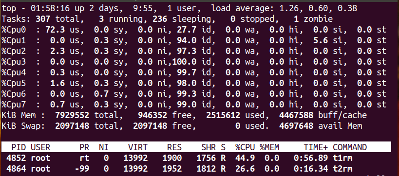
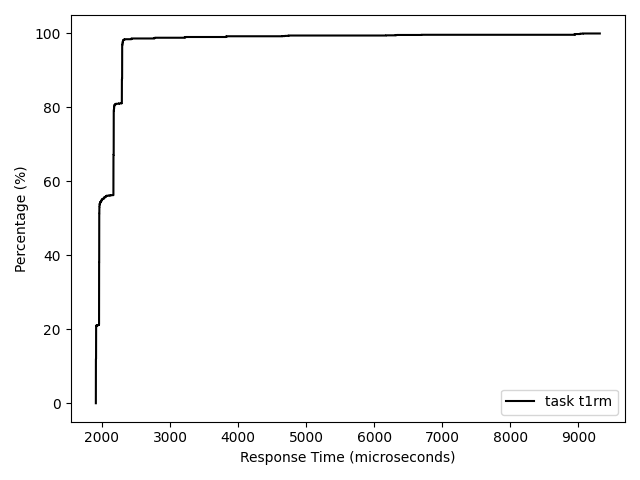

# CSC9006 Real-Time Systems, Lab 1

[TOC]

## Introduction

This lab assignment is an integrated part of the [real-time systems](https://wangc86.github.io/csc9006/) course taught at [National Taiwan Normal University](https://www.ntnu.edu.tw/). You have two weeks to complete this lab. The hard deadline of submission is Tuesday 10 PM, 3/31/2020.

In class, we introduced two classic real-time scheduling algorithms: Rate-Monotonic (RM) and Earliest-Deadline-First (EDF). We gave a simple, two-task example to illustrate how the algorithms work, and we had a glimpse on the use of utilization bound for a schedulability test. 

In this lab, we will go through some _empirical evaluation_ of RM. Throughout the process, we will

* use the C++11 standard library `chrono` to measure the response time of a program
* leverage linux's support for real-time computing (`man sched`) to implement the RM scheduling algorithm
* use signal handling to measure the deadline miss ratios of tasks in a task set
* visualize experimental results (using [Matplotlib](https://matplotlib.org))

In the following, the text in **boldface** indicates the materials that you should push to your GitHub repository.

Let's begin :)


## Measuring the response time of a program

In real-time systems, we often care about the response time of a program. Among various time utilities, I found C++'s `chrono` library in particular suitable for our need. There are at least two great C++ reference sites where you may learn about the library: [cppreference.com](https://en.cppreference.com/w/cpp/chrono) and [cplusplus.com](http://www.cplusplus.com/reference/chrono/?kw=chrono). Spend some time to get yourself familiar with the sites.

To measure the response time of a task, we will use type `std::chrono::system_clock::time_point` to declare time variables. We then use `std::chrono::system_clock::now()` to get the current point of time. Now, by subtracting the end time of a job execution by its start time, we may determine the response time. This is achieved by `std::chrono::duration`. Check out the [C++ documentation](https://en.cppreference.com/w/cpp/chrono/duration) to learn more.

The following C++ snippet is an example:

```c++
#include <iostream>
#include <chrono>

int main (void)
{
        std::chrono::system_clock::time_point startTime = std::chrono::system_clock::now();
        // some workload
        std::chrono::system_clock::time_point endTime = std::chrono::system_clock::now();
        const int delta = std::chrono::duration_cast<std::chrono::microseconds>(endTime - startTime).count();
        std::cout << "response time of our workload = " << delta << " us" << std::endl;
        return 0;
}
```

To compile with some earlier version of g++, we may need to make the compiler know that we are using C++11's feature:

```bash
g++ -std=c++11 main.cpp
```


## Tuning the workload of our task

As discussed in class, a job's workload essentially determines its execution time. But in a system the response time of a job is often much larger than the execution time of it, because there are other jobs competing for the CPU resources. To better measure the execution time of our example tasks, we want to reduce the likelihood for other jobs to preempt the jobs of our target tasks. In Linux, we may achieve so by assigning a real-time scheduling policy and a scheduling priority to our task (i.e., a process).

Here, according to Linux Programmer's Manual (i.e., `man`), we use`sched_setscheduler` (read its documentation by typing `man sched_setscheduler` on the command-line prompt). The following is an example function that wraps the functionality we want:

```c++
#define _GNU_SOURCE
#include <sched.h>
#include <stdio.h>

void setSchedulingPolicy (int policy, int priority)
{
    sched_param sched;
    sched_getparam(0, &sched);
    sched.sched_priority = priority;
    if (sched_setscheduler(0, policy, &sched)) {
        perror("sched_setscheduler");
        exit(EXIT_FAILURE);
    }
}
```

In the above function, we first use `sched_getparam` to get the related scheduling parameters for the calling process (again, type `man sched_getparam` to learn more), and then we set up the right scheduling policy and priority for the process by calling `sched_setscheduler`. 

Try to call the above function at the very beginning of your program, with `policy` setting to `SCHED_FIFO` and `priority` setting to `99`. Re-compile and run your program several times. Note that now you need to run the program as a superuser for the permission to set the scheduler:

```bash
sudo ./a.out
```

You should see that the the response times has become more stable. Type `man sched` to learn more detail about the scheduling policy `SCHED_FIFO`.

Now, we are ready to create a task with some specific workload. We will use this as a building block to construct some tasks for our empirical evaluation of EM. **Write a program and name it *1ms.cpp*, to create an one-millisecond workload. Push the cpp file to your GitHub repo.** The following example may serve as a starting point:

```c++
#define _GNU_SOURCE
#include <sched.h>
#include <stdio.h>

#include <iostream>
#include <chrono>
#include <cmath>

void setSchedulingPolicy (int policy, int priority)
{
    sched_param sched;
    sched_getparam(0, &sched);
    sched.sched_priority = priority;
    if (sched_setscheduler(0, policy, &sched)) {
        perror("sched_setscheduler");
        exit(EXIT_FAILURE);
    }
}

void workload_1ms (void)
{
        int repeat = 100000; // tune this for the right amount of workload
        for (int i = 0; i <= repeat; i++)
        {
                // add some computation here (e.g., use sqrt() in cmath)
        }
}

int main (void)
{
        setSchedulingPolicy (SCHED_FIFO, 99);
        std::chrono::system_clock::time_point startTime = std::chrono::system_clock::now();
        workload_1ms ();
        std::chrono::system_clock::time_point endTime = std::chrono::system_clock::now();
        const int delta = std::chrono::duration_cast<std::chrono::microseconds>(endTime - startTime).count();
        std::cout << delta << std::endl;

        return 0;
}
```

After several attempts to tune the workload, you may still find that the response time vibrates quite a lot. Don't worry. There are some other factors that will affect the timing performance of a program running in Linux, and we ignore them for now. To learn more, see Section 'Further reading' at the end of this document.


## Creating a periodic task set

Now, let's turn our one-time workload into a periodic workload. The idea is simple: after executing the workload, calculate the response time, and then suspend the process for an interval equal to the period minus the response time. The following code illustrates the idea:

```c++
#define _GNU_SOURCE
#include <sched.h>
#include <stdio.h>
#include <iostream>
#include <chrono>
#include <cmath>
#include <unistd.h>

...

int main (void)
{
    int period = 5000; // unit: microsecond
    int delta;
    setSchedulingPolicy (SCHED_FIFO, 99);
    while (1)
    {
        std::chrono::system_clock::time_point startTime = std::chrono::system_clock::now();
        for (int j = 0; j < 2; j++)
        {
            workload_1ms ();
        }
        std::chrono::system_clock::time_point endTime = std::chrono::system_clock::now();
        delta = std::chrono::duration_cast<std::chrono::microseconds>(endTime - startTime).count();
        if (delta > period)
        {
            continue;
        }
        else
        {
            usleep (period-delta);
        }
    }
    return 0;
}
```

The above code implements a task with period = 5 ms and workload of 2 ms execution time. Running this code should consume about 40% of CPU cycles, which can be verified via the `top` utility. Assume an implicit deadline. Note that this implementation has an issue in periodicity: whenever a job of the task missed its deadline, the interval between two job releases will be longer than the period. This happens since we do not kill a job once it missed its deadline. Whether to kill a delayed job or not is an important design choice. But we do not worry about it for now.

Now, follow the above code and implement three periodic tasks t1, t2, and t3, with t1's period = 5 ms and execution time = 2 ms, t2's period = 7 ms and execution time = 2 ms, and t3's period = 7 ms and execution time = 4 ms. 

You can run them concurrently by typing the following three:

```bash
sudo ./t1 &
sudo ./t2 &
sudo ./t3 &
```

and kill them by typing the following three:

```bash
sudo pkill -SIGKILL t1
sudo pkill -SIGKILL t2
sudo pkill -SIGKILL t3
```

It is likely that these three tasks will run on different CPU cores. Again, you can verify this via the `top` utility. For our evaluation purpose, we need to assign tasks to the same CPU core. This can be achieved by `sched_setaffinity` (again, type `man sched_setaffinity` to learn more about it). The following example function `pinCPU` illustrate the usage:

```c++
void pinCPU (int cpu_number)
{
    cpu_set_t mask;
    CPU_ZERO(&mask);

    CPU_SET(cpu_number, &mask);

    if (sched_setaffinity(0, sizeof(cpu_set_t), &mask) == -1)
    {
        perror("sched_setaffinity");
        exit(EXIT_FAILURE);
    }
}
```

Calling `pinCPU(0)` at the beginning of the program ensure that the rest of the code will be executed on core 0 :

```c++
int main (void)
{
    pinCPU (0);
    ...
```

Now, modify your program so that all of t1, t2, and t3 will run on CPU 0 when put into execution. Verify this by running t1 an t2 concurrently, and **take a screen shot of `top` showing the row of %Cpu0** (you need to press `1` after typing `top` to see each CPU core's utilization). The following is an example screen shot:



 

## Implementing RM scheduling

Implementing RM scheduling on Linux is straightforward with the help of the built-in `SCHED_FIFO` scheduling policy. Recall that under RM scheduling, the task having a higher rate will be assigned a higher priority, and a running task of a lower priority will be preempted by a task of a higher priority. Therefore, to schedule our task set using RM scheduling, we may assign priority=99 to t1 and priority=98 to both t2 and t3, and use scheduling policy `SCHED_FIFO` for all t1, t2, and t3.

Implement RM scheduling for tasks t1, t2, and t3. Name the executables t1rm, t2rm, and t3rm. Spend some time trying to run some of them concurrently and see how %CPu0 changes.


## Getting RM scheduling statistics

Now let's get some statistics for this task set. We will use [signal handling](http://www.cplusplus.com/reference/csignal/signal/) for this purpose.

First, here is an example to use signal SIGINT to count the # of t1's jobs executed so far:

```c++
...
#include <signal.h>
...
sig_atomic_t t = 0;
void collectData (int param)
{
    std::cout << ::t << std::endl;
}

int main (void)
{
    void (*prev_handler)(int);
    prev_handler = signal (SIGINT, collectData);

    int period = 5000; // unit: microsecond
    int delta;
    pinCPU (0);
    setSchedulingPolicy (SCHED_FIFO, 99);
    while (1)
    {
        std::chrono::system_clock::time_point startTime = std::chrono::system_clock::now();
        for (int j = 0; j < 2; j++)
        {
            workload_1ms ();
        }
        std::chrono::system_clock::time_point endTime = std::chrono::system_clock::now();
        delta = std::chrono::duration_cast<std::chrono::microseconds>(endTime - startTime).count();
        ::t++;
...
```

At one terminal, run

```bash
sudo ./t1rm &
```

Now open a new terminal and run

```bash
sudo pkill -SIGINT t1rm
```

Then in the first terminal it will output the value of variable t. Spend some time play with it, and run it multiple times to see how the output changes.

Once you're done, at the second terminal run the following command to kill the task:

```bash
sudo pkill -SIGKILL t1rm
```

Follow the similar steps, we may modify the program to query the current deadline miss ratio of a task. The deadline miss ratio is defined as (# of jobs missing their deadline)/(# of jobs executed). **Complete the code for t1rm, t2rm, and t3rm, so that you may use SIGINT to get the current deadline miss ratio of a task. Put your code into your GitHub repo**


## Evaluating the timing performance of RM scheduling

Now we are ready to do some empirical evaluation of RM scheduling!

In conducting experiments, it is often helpful to write a script to automatically execute a series of commands. The following is an example bash script that outputs the deadline miss ratio of t1rm and t3rm after 10 seconds (and 20 seconds) of execution:

```bash
#!/bin/bash
sudo ./t1rm &
sudo ./t3rm &
sleep 10
sudo pkill -SIGINT t1rm
sudo pkill -SIGINT t3rm
sleep 10
sudo pkill -SIGINT t1rm
sudo pkill -SIGINT t3rm
sleep 5
sudo pkill -SIGKILL t1rm
sudo pkill -SIGKILL t3rm
```

Copy and save the above script into a file named 'test.sh' and then run the script by typing

```bash
bash test.sh
```

and here is an example output:

```bash
0.000503778
0.069697
0.000754907
0.0683631
./test.sh: line 11:  1431 Killed                  sudo ./t1rm
./test.sh: line 12:  1432 Killed                  sudo ./t3rm

```

It shows that the deadline miss ratio of t3rm is about 6%.

**Now, save your output of test.sh to a file named 'rm.output' and put it in your GitHub repo.**

Now we compare the deadline miss ratios under RM with that under an artificial scheduling algorithm named RMI (shorthand for RM-Inverse). In RMI, in contrast to RM, we assign a higher priority to a task of lower rate. In our task set, you can simply switch the priority levels, by replacing the priority level of t1 by that of t2 and the priority level of both t2 and t3 by the previous priority level of t1. Name the new code t1rmi, t2rmi, and t3rmi, respectively.

Run the following script to get the deadline miss ratio of t1rmi and t3rmi:

```bash
#!/bin/bash
sudo ./t1rmi &
sudo ./t3rmi &
sleep 10
sudo pkill -SIGINT t1rmi
sudo pkill -SIGINT t3rmi
sleep 10
sudo pkill -SIGINT t1rmi
sudo pkill -SIGINT t3rmi
sleep 5
sudo pkill -SIGKILL t1rmi
sudo pkill -SIGKILL t3rmi
```

**Save your output to a file named 'rmi.output' and put it in your GitHub repo.**

**Compare the deadline miss ratios under RM and RMI. Write your observation and save it to a file named 'cmp.txt' and put it in your GitHub repo.**


## Plotting the response time

In systems research, we often need to plot our experimental results. The following is an example code to save 2000 samples of the response time of task t1rm:

```c++
#include <fstream>
...
sig_atomic_t t = 0;
void collectData (int param)
{
    std::ofstream outFile;
    outFile.open ("responseTime_t1rm.out");
    for (int i = 0; i < 2000; i++)
    {
        outFile << ::out[i] << std::endl;
    }
    outFile.close();
}

int main (void)
{
    void (*prev_handler)(int);
    prev_handler = signal (SIGINT, collectData);

    int period = 5000; // unit: microsecond
    int delta;
    pinCPU (0);
    setSchedulingPolicy (SCHED_FIFO, 99);
    while (1)
    {
        std::chrono::system_clock::time_point startTime = std::chrono::system_clock::now();
        for (int j = 0; j < 2; j++)
        {
            workload_1ms ();
        }
        std::chrono::system_clock::time_point endTime = std::chrono::system_clock::now();
        delta = std::chrono::duration_cast<std::chrono::microseconds>(endTime - startTime).count();
        if (::t < 2000)
        {
            ::out[::t++] = delta;
        }
        ...
```

here we name the executable by 'response', and we can use the following bash script to collect those 2000 samples:

```bash
#!/bin/bash
sudo ./response &
sleep 12
sudo pkill -SIGINT response
sleep 5
sudo pkill -SIGKILL response
```

and let's plot the cumulative distribution function of the response time using [Matplotlib](https://matplotlib.org).

Install Matplotlib according to [the official instruction](https://matplotlib.org/users/installing.html).

Use this plotting code:

```python
import numpy as np
import matplotlib.pyplot as plt

rt = np.loadtxt('./responseTime_t1rm.out')

fig1, ax1 = plt.subplots()

n = np.arange(1,len(rt)+1) / np.float(len(rt)) * 100
rtSorted = np.sort(rt)
ax1.step(rtSorted, n, color='k', label='task t1rm')

ax1.set_xlabel('Response Time (microseconds)')
ax1.set_ylabel('Percentage (%)')

plt.legend()
plt.tight_layout()
plt.show()
#plt.savefig('./responseTimeCDF.pdf',
#            format='pdf', dpi=1000, bbox_inches='tight')

```

name it 'cdf.py' and we can plot by typing

```bash
python3 cdf.py
```

which will give us the following figure :)



The figure shows that there are some job has response time exceeding the 5 ms period, which aligns with our earlier observation when evaluating RM scheduling.

**Now, follow the same procedure and plot the response time distribution of your task t1rm. Put it in your GitHub repo.**


## Summary

Here's a recap of what you should push to your GitHub repo:

* A file named *1ms.cpp* that includes your function for a one-millisecond workload.
* A screen shot of `top` showing the row of %Cpu0 when you concurrently run t1 and t2 on cpu 0.
* The code for tasks t1rm, t2rm, and t3rm, which enable the use of signal SIGINT to get the current deadline miss ratio.
* Files named 'rm.output' and 'rmi.output' for the deadline miss ratios under RM and RMI, and a file named 'cmp.txt' including your observation of the results. 
* The figure of t1rm's response time distribution.


In this lab, we have conducted some basic empirical evaluation of the RM scheduling algorithm. Our construct of synthetic workload was not perfect, and we chose to ignore some further configurations. Nevertheless, by comparing the RM scheduling algorithm with an artificial alternative RMI, we still see some merits of the algorithm. More importantly, we have learned to use a couple of useful tools, and we are more familiar with this kind of systems research. We are gaining good experience to experimental computer science research!  


## Further study ##

For a general-purpose operating system, timeliness of program execution is not the solely goal. For example, power-saving is important for laptops, and therefore the OS may perform [CPU frequency scaling](https://en.wikipedia.org/wiki/Dynamic_frequency_scaling) that to dynamically adjust the CPU speed to prolong the battery life. Practical concerns like this often make it harder to study the timing performance of a system. As another example, to prevent long-running real-time tasks from freezing the system, in Linux those real-time tasks by default can only use 95% of all CPU cycles (type `man sched` and read the section 'Limiting the CPU usage of real-time and deadline processes' to learn more about this). Being aware of your system's configuration is important in systems research.
