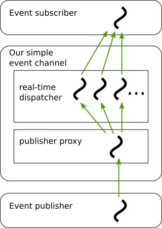

# CSC9006 Real-Time Systems, Lab 2

[TOC]

## 1. Introduction

This lab assignment is an integrated part of the [real-time systems](https://wangc86.github.io/csc9006/) course taught at [National Taiwan Normal University](https://www.ntnu.edu.tw/). You have about three weeks to complete this lab. The hard deadline of submission is Friday 10 PM, 5/15/2020.

In class, we covered priority inversion and two protocols to amend it, and you've studied the classic TAO real-time event service. In this lab, we will first build a multi-threaded program to empirically evaluate the performance of the Priority Ceiling Protocol (PCP) and the Priority Inheritance Protocol (PIP). Then we will use this program to construct a simple, multi-threaded real-time event service (as shown in the figure below). We will use this event service as a sand box to aid our study of the topics covered in this course. Throughout the process, we will learn

* the [pthreads](https://en.wikipedia.org/wiki/POSIX_Threads) standard for multi-threaded programming;
* [gRPC](https://grpc.io/), Google's RPC framework, to create distributed applications ;



In the following, the text in **boldface** indicates the materials that you should push to your GitHub repository. The pthreads examples are adopted from the book ["Pthreads Programming: A POSIX Standard for Better Multiprocessing"](https://www.amazon.com/PThreads-Programming-Standard-Multiprocessing-Nutshell-ebook-dp-B00B5KBVHK/dp/B00B5KBVHK/ref=mt_kindle?_encoding=UTF8&me=&qid=1586584251) by Bradford Nichols, Dick Buttlar, and Jacqueline Proulx Farrell ([example code](https://resources.oreilly.com/examples/9781565921153/)).

Let's begin :)


## 2. Introducing Pthreads

Recall that in Linux we may use the *fork* system call to create a new process. The following is an example program that spawns two child processes to perform some work. The parent process then collects the result from each child process.

````c
#include <stdlib.h>
#include <stdio.h>
#include <unistd.h>
#include <sys/types.h>
#include <sys/ipc.h>
#include <sys/shm.h>
#include <sys/wait.h>
#include <errno.h>  

void do_one_thing(int *);
void do_another_thing(int *);
void do_wrap_up(int, int);

int   shared_mem_id;
int   *shared_mem_ptr;
int   *r1p;
int   *r2p;

extern int main(void)
{
  pid_t  child1_pid, child2_pid;
  int  status;

  /* initialize shared memory segment */
  if ((shared_mem_id = shmget(IPC_PRIVATE, 2*sizeof(int), 0660)) == -1)
    perror("shmget"), exit(1);
  if ((shared_mem_ptr = (int *)shmat(shared_mem_id, (void *)0, 0)) == (void *)-1)
    perror("shmat failed"), exit(1);

  r1p = shared_mem_ptr;  
  r2p = (shared_mem_ptr + 1);
  *r1p = 0;
  *r2p = 0;

  if ((child1_pid = fork()) == 0) {
    /* first child */
    do_one_thing(r1p);
    return 0;
  } else if (child1_pid == -1) {
    perror("fork"), exit(1);
  }

  /* parent */
  if ((child2_pid = fork()) == 0) {
    /* second child */
    do_another_thing(r2p);
    return 0;
  } else if (child2_pid == -1) {  
    perror("fork"), exit(1);
  }

  /* parent */
  if ((waitpid(child1_pid, &status, 0) == -1))
	perror("waitpid"), exit(1);
  if ((waitpid(child2_pid, &status, 0) == -1))
	perror("waitpid"), exit(1);

  do_wrap_up(*r1p, *r2p);
 
  return 0; 
}

void do_one_thing(int *pnum_times)
{
  int i, j, x;
  
  for (i = 0;  i < 4; i++) {
    printf("doing one thing\n"); 
    for (j = 0; j < 10000; j++) x = x + i;
    (*pnum_times)++;
  }
}

void do_another_thing(int *pnum_times)
{
  int i, j, x;
  
  for (i = 0;  i < 4; i++) {
    printf("doing another \n"); 
    for (j = 0; j < 10000; j++) x = x + i;
    (*pnum_times)++;
  }
}

void do_wrap_up(int one_times, int another_times)
{
  int total;

  total = one_times + another_times;
  printf("All done, one thing %d, another %d for a total of %d\n",
	one_times, another_times, total);
}
````

Name the above code by "simple_processes.c" and compile it by 

```bash
g++ -o simple_processes simple_processes.c
```

Try to execute it several times and observe that the execution sequence varied. This is due to the underlying choice of OS scheduling policies. We have touched that topic in Lab1.

Now, you can think of threads as lightweight processes.

As a quick example, in the following we use *pthreads* to implement the same program semantics:

```c
#include <stdlib.h>
#include <stdio.h>
#include <errno.h>
#include <pthread.h>

void *do_one_thing(void *);
void *do_another_thing(void *);
void do_wrap_up(int, int);

int r1 = 0, r2 = 0;

extern int
main(void)
{
  pthread_t thread1, thread2;
  if (pthread_create(&thread1, 
		 NULL,
		 do_one_thing,
		 (void *) &r1) != 0)
	perror("pthread_create"), exit(1); 

  if (pthread_create(&thread2, 
		 NULL, 
		 do_another_thing,
		 (void *) &r2) != 0)
	perror("pthread_create"), exit(1); 
  
  if (pthread_join(thread1, NULL) != 0)
	perror("pthread_join"),exit(1);

  if (pthread_join(thread2, NULL) != 0)
	perror("pthread_join"),exit(1);

  do_wrap_up(r1, r2);

  return 0; 
}

void *do_one_thing(void *pnum_times)
{
  int i, j, x;
  for (i = 0;  i < 4; i++) {
    printf("doing one thing\n"); 
    for (j = 0; j < 10000; j++) x = x + i;
    (*(int *)pnum_times)++;
  }
  return(NULL);
}

void *do_another_thing(void *pnum_times)
{
  int i, j, x;
  for (i = 0;  i < 4; i++) {
    printf("doing another \n"); 
    for (j = 0; j < 10000; j++) x = x + i;
    (*(int *)pnum_times)++;
  }
  return(NULL);
}

void do_wrap_up(int one_times, int another_times)
{
  int total;
  total = one_times + another_times;
  printf("All done, one thing %d, another %d for a total of %d\n",
	one_times, another_times, total);
}
```

And the above code can be compiled as follows (name it as "simple_threads.c"):

```bash
g++ -o simple_threads ./simple_threads.c -pthread
```

here we link the pthreads library via ``-pthread`` (or ``-lpthread``).

You may learn a lot more about pthreads by reading the Linux Programmer's Manual: 

```bash
man pthreads
```

For example, in it you may find the difference of *LinuxThreads* and *NPTL (Native POSIX Threads Library)*. 

Type ``man pthread_create`` and ``man pthread_join`` to learn theses pthreads building blocks.

Now, we are going to use pthreads to implement a set of real-time tasks similar to those in Lab 1. This time, we will spawn and run the tasks from within one single program. In particular, we will implement each real-time *task* as a *thread* with a certain priority level.

Create three tasks, say  $\tau_1$, $\tau_2$, and $\tau_3$, with the following specification:

| Task     | Period (ms) | Worst-Case Execution Time (ms) |
| -------- | ----------- | ------------------------------ |
| $\tau_1$ | 50          | 1                              |
| $\tau_2$ | 100         | 50                             |
| $\tau_3$ | 200         | 10                             |

Be sure you have correctly pinned all tasks to the same CPU core, and that you've assigned them with the real-time priority levels following the rate-monotonic policy. Here are two helper functions for you:

```c++
void pinCPU (int cpu_number)
{
    cpu_set_t mask;
    CPU_ZERO(&mask);

    CPU_SET(cpu_number, &mask);

    if (sched_setaffinity(0, sizeof(cpu_set_t), &mask) == -1)
    {
        perror("sched_setaffinity");
        exit(EXIT_FAILURE);
    }
}

void setSchedulingPolicy (int newPolicy, int priority)
{
    sched_param sched;
    int oldPolicy;
    if (pthread_getschedparam(pthread_self(), &oldPolicy, &sched)) {
        perror("pthread_setschedparam");
        exit(EXIT_FAILURE);
    }
    sched.sched_priority = priority;
    if (pthread_setschedparam(pthread_self(), newPolicy, &sched)) {
        perror("pthread_setschedparam");
        exit(EXIT_FAILURE);
    }
}
```

Depending on your hardware setup, you may need to set a static CPU frequency. Tools such as [cpufreq-set](http://manpages.ubuntu.com/manpages/bionic/man1/cpufreq-set.1.html) can be very handy for this purpose. What I did was to set the CPU frequency upper limit to 2GHz for all CPU cores on my laptop, and set the governor to *performance*.

**Think about how to observe that it is indeed necessary to set a static CPU frequency or not. Write down your reasoning into a txt file. Name the file analysis.txt and list your responses one by one. This is question#1, and there are some more questions for you in the following.**

After spending some effort thinking about it yourself, do not hesitate to discuss your result/question with your classmates or with me! A critical part of the learning process is to discuss your ideas with people. Experience has told me that, and I hope it would also help you.


## 3. Dealing with Priority Inversion ##

Now we are ready to see how the priority inversion may manifest in a program.

First of all, add critical sections for the high-priority task and the low-priority tasks in your program:

```c++
//...
pthread_mutex_t mutex_section1 = PTHREAD_MUTEX_INITIALIZER;
//...

// In the high-priority task, before or after running the 1ms workload
        // entering the critical section ...
        {
        pthread_mutex_lock (&mutex_section1);
	    // TODO: add some workload here
        pthread_mutex_unlock (&mutex_section1);
        }
        // leaving the critical section ...
//...
// In the low-priority task, before or after running the 10ms workload
        // entering the critical section ...
        {
        pthread_mutex_lock (&mutex_section1);
	    // TODO: add some workload here
        pthread_mutex_unlock (&mutex_section1);
        }
        // leaving the critical section ...


```

**Extend your task set to include more middle-priority tasks. Run it several times, tune you workload for each task and/or add more middle-priority tasks, until you see that the response time of the high-priority task would exceed 5ms occasionally. Save and upload that evidence.**

Now, under the same configuration, create another version of your code, and let's plug in pthread's support for the Priority Ceiling Protocol:

```c++
// the PCP is applied to the mutex that protects the critical sections
    pthread_mutexattr_t mutexattr_prioceiling;
    int mutex_protocol, high_prio;
    high_prio = sched_get_priority_max(SCHED_FIFO);
    pthread_mutexattr_init (&mutexattr_prioceiling);
    pthread_mutexattr_getprotocol (&mutexattr_prioceiling,
                                   &mutex_protocol);
    pthread_mutexattr_setprotocol (&mutexattr_prioceiling,
                                   PTHREAD_PRIO_PROTECT);
    pthread_mutexattr_setprioceiling (&mutexattr_prioceiling,
                                      high_prio);
    pthread_mutex_init (&mutex_section1, &mutexattr_prioceiling);
```

Again, create another version of your code, and this time plug in the Priority Inheritance Protocol:

```c++
// similarly, the PIP is applied to the mutex
    pthread_mutexattr_t mutexattr_prioinherit;
    int mutex_protocol;
    pthread_mutexattr_init (&mutexattr_prioinherit);
    pthread_mutexattr_getprotocol (&mutexattr_prioinherit,
                                   &mutex_protocol);
    if (mutex_protocol != PTHREAD_PRIO_INHERIT)
    {
        pthread_mutexattr_setprotocol (&mutexattr_prioinherit,
                                       PTHREAD_PRIO_INHERIT);
    }
    pthread_mutex_init (&mutex_section1, &mutexattr_prioinherit);

```

Now run these two versions, and see that now the high-priority task's response time stays around 1ms. **Upload your evidence.**


## 4. The First Version of Our Real-Time Event Service

Now we have some experience with pthreads, and we know how to specify a priority level to each thread and schedule all threads. Let's apply our knowledge to build a distributed multi-threaded event service!


### 4.1 Specification

Our real-time event service has the following specification:

1. Each event is published by an event publisher in terms of data of a certain topic. The topic name indicate the priority level. For now, we only consider three topics:

   1. H (high priority)
   2. M (middle priority)
   3. L (low priority)

2. An event publisher must choose one of the three priority levels for the data it would like to publish, in the following format (suppose ``es_pub`` is the name of the program):

   > $ ./es_pub  -t  [H|M|L]  -m  [data]

   For example, by ``./es_pub -t H -m hi``  the event publisher will publish high-priority data 'hi' .

3. An event subscriber must choose one of the three priority levels, and it will receive all data of that priority level. The format is (suppose ``es_pub`` is the name of the program):

   > $ ./es_sub -t [H|M|L]

   For example, by ``./es_sub -t M`` the event subscriber will receive all data of the middle priority level.

4. The event service must process all data in the order of priority level.

(Note that this is a compact, updated version; the version I demonstrated in class has some unnecessary parts.)

In the following, we will go through each step and in the end we will have a simple event service like this:


Within the even channel, we will use a set of real-time threads to dispatch the events to the event subscriber, following the order of each priority level.

Let's begin!


### 4.2 gRPC Installation and Setup

We need a set of tools to build the communication channels between the event publisher and the event service, and between the event service and the event subscriber. In this Lab we choose gRPC. Follow this [link](https://grpc.io/docs/guides/) and get an overview of gRPC.

Let's follow this [gRPC C++ Quick Start](https://grpc.io/docs/quickstart/cpp/) to setup gRPC. Some note regarding the setup procedure:

1. Check that the version of cmake is at least 3.13. If you use ``wget`` to install a newer version of cmake, be sure to place its execution path *before* the execution path of the older cmake. This can be achieved by setting

   > \$ export PATH="​\$MY_INSTALL_DIR/bin:$PATH" 

   Note how it differs from the instruction provided in the C++ Quick Start guide.

2. The command ``make -j`` may fail (``man make`` to learn what the ``-j`` option is). If that happened, simply type ``make`` instead.

3. To learn more about commands ``pushd`` and ``popd``, read this [tutorial](https://www.howtoforge.com/linux-pushd-popd-command/).

Make sure you can compile and run the Hello World Example in the quick start guide. Carefully study the example before you move on. Also, follow this [link](https://grpc.io/docs/guides/concepts/) to get some better idea regarding the concept of gRPC.

In the following, whenever we need to compile our code, we need to first create a folder ``cmake/build/`` and type the following command there before we type ``make``:

> \$ cmake -DCMAKE_PREFIX_PATH=$MY_INSTALL_DIR ../..


### 4.3 The Interface of Our Event Service

gRPC uses Google's protocol buffer as its IDL (interface description language). Here is the complete protocol buffer definitions for our real-time event service:

```c++
syntax = "proto3";
option java_multiple_files = true;
option java_package = "io.grpc.es";
option java_outer_classname = "EventServiceProto";
option objc_class_prefix = "ES";
import public "google/protobuf/timestamp.proto";
package es;

// Interface exported by the server.
service EventService {
  rpc Subscribe(TopicRequest) returns (stream TopicData) {}
  rpc Publish(stream TopicData) returns (NoUse) {}
}

message TopicRequest {
  string topic = 2;
}

message TopicData {
  string topic = 1;
  string data = 2;
  google.protobuf.Timestamp timestamp = 3;
}

message NoUse {
}
```

Our event service has two RPCs, ``Subscribe`` and ``Publish``. An event subscriber will invoke the ``Subscribe`` RPC to receive data, and an event publisher will invoke the ``Publish`` RPC to send data. The ``TopicRequest`` message is used by an event subscriber to request a certain topic (``H``, ``M``, or ``L``, as a string), and the event service will return to it a series of ``TopicData`` messages (hence the stream). ``TopicData`` has three name-value pairs, for the topic, data, and time stamp, respectively. Finally, the ``Publish`` RPC invoked by an event publisher will carry a series of ``TopicData``.  For simplicity, the event publisher will not ask for any return value, and here `NoUse` is just a place holder.

The gRPC C++ Quick Start (i.e., what you've just accomplished) made use of [simple RPC](https://grpc.io/docs/tutorials/basic/cpp/):

> A *simple RPC* where the client sends a request to the server using the stub and waits for a response to come back, just like a normal function call.

In our event service, we are going a bit further and will use both [server-side and client-side streaming RPC](https://grpc.io/docs/tutorials/basic/cpp/):

> A *server-side streaming RPC* where the client sends a request to the server and gets a stream to read a sequence of messages back. The client reads from the returned stream until there are no more messages. As you can see in our example, you specify a server-side streaming method by placing the `stream` keyword before the *response* type.
>
> A *client-side streaming RPC* where the client writes a sequence of messages and sends them to the server, again using a provided stream. Once the client has finished writing the messages, it waits for the server to read them all and return its response. You specify a client-side streaming method by placing the `stream` keyword before the *request* type.

**Think about why we choose to use streaming RPC. Write it down as answer#2 in your analysis.txt.** 

In the following, we divide our work into four steps:

1. Communication between Event Service and Event Subscriber
2. Communication between Event Publisher and Event Service
3. Communication between Event Publisher and Event Subscriber via Event Service
4. Real-Time Processing within Event Service


### 4.4 Event Service <-> Event Subscriber

Let's take a look at the service code:

```c++
/*
 * Copyright 2020 Chao Wang
 * This code is based on an example from the official gRPC GitHub
 *
 * Copyright 2015 gRPC authors.
 *
 * Licensed under the Apache License, Version 2.0 (the "License");
 * you may not use this file except in compliance with the License.
 * You may obtain a copy of the License at
 *
 *     http://www.apache.org/licenses/LICENSE-2.0
 *
 * Unless required by applicable law or agreed to in writing, software
 * distributed under the License is distributed on an "AS IS" BASIS,
 * WITHOUT WARRANTIES OR CONDITIONS OF ANY KIND, either express or implied.
 * See the License for the specific language governing permissions and
 * limitations under the License.
 *
 */

#include <iostream>
#include <memory>
#include <string>
#include <grpcpp/grpcpp.h>
#include <grpcpp/health_check_service_interface.h>
#include <grpcpp/ext/proto_server_reflection_plugin.h>

#include "es.grpc.pb.h"

using grpc::Server;
using grpc::ServerBuilder;
using grpc::ServerContext;
using grpc::Status;
using grpc::ServerWriter;

using es::TopicRequest;
using es::EventService;
using es::TopicData;

class EventServiceImpl final : public EventService::Service {
  Status Subscribe(ServerContext* context,
                   const TopicRequest* request,
                   ServerWriter<TopicData>* writer) override {
    // TODO: send data of the requested topic to this subscriber
    return Status::OK;
  }
};

void RunServer() {
  std::string server_address("0.0.0.0:50051");
  EventServiceImpl service;

  grpc::EnableDefaultHealthCheckService(true);
  grpc::reflection::InitProtoReflectionServerBuilderPlugin();
  ServerBuilder builder;
  // Listen on the given address without any authentication mechanism.
  builder.AddListeningPort(server_address, grpc::InsecureServerCredentials());
  // Register "service" as the instance through which we'll communicate with
  // clients. In this case it corresponds to an *synchronous* service.
  builder.RegisterService(&service);
  // Finally assemble the server.
  std::unique_ptr<Server> server(builder.BuildAndStart());
  std::cout << "Server listening on " << server_address << std::endl;

  // Wait for the server to shutdown. Note that some other thread must be
  // responsible for shutting down the server for this call to ever return.
  server->Wait();
}

int main(int argc, char** argv) {
  RunServer();

  return 0;
}
```

Here ``RunServer()`` includes the boilerplate code to start the gRPC server. Conceptually, it establishes *a contact point* for clients to connect to it and exchange data.

Class ``EventServiceImpl()`` defines the behavior of the server. It describes the functions available to clients, as well as the internal logic. Later on, we will populate this class with our prioritized dispatching functionality. 

Notice the following inclusion in the code:

> #include "es.grpc.pb.h"

This is one of the header files generated by the protobuf compiler, using our definitions in ``es.proto``. Take a look at that header file and the related files, and see how the compiler helps us here - It is a substantial amount of work! You may wonder how a human developer makes use of those files. Fortunately, that code was created by the compiler and was created *for* the compiler. We just need to make sure to instruct the compiler to make use of those pieces of code. Usually, a human developer should only need to consult the protocol buffer definitions in ``es.proto`` - and that code was meant to be human-readable :)

Finally, notice the following lines in the code:

> using grpc::Server;
> ...
> using es::TopicRequest;
> using es::EventService;
> using es::TopicData;

This is how we make use of those definitions in ``es.proto`` and in some other default protos. 

Now let's take a look at the subscriber code:

```c++
/*
 * Copyright 2020 Chao Wang
 * This code is based on an example from the official gRPC GitHub
 *
 * Copyright 2015 gRPC authors.
 *
 * Licensed under the Apache License, Version 2.0 (the "License");
 * you may not use this file except in compliance with the License.
 * You may obtain a copy of the License at
 *
 *     http://www.apache.org/licenses/LICENSE-2.0
 *
 * Unless required by applicable law or agreed to in writing, software
 * distributed under the License is distributed on an "AS IS" BASIS,
 * WITHOUT WARRANTIES OR CONDITIONS OF ANY KIND, either express or implied.
 * See the License for the specific language governing permissions and
 * limitations under the License.
 *
 */

#include <iostream>
#include <memory>
#include <string>

#include <grpcpp/grpcpp.h>

#include "es.grpc.pb.h"

using grpc::Channel;
using grpc::ClientContext;
using grpc::Status;
using grpc::ClientReader;

using es::TopicRequest;
using es::EventService;
using es::TopicData;

class Subscriber {
 public:
  Subscriber(int pubID, std::shared_ptr<Channel> channel)
      : id_(pubID),
        stub_(EventService::NewStub(channel)) {}

  void Subscribe(TopicRequest request) {
    ClientContext context;
    TopicData td;
    std::unique_ptr<ClientReader<TopicData> > reader(
        stub_->Subscribe(&context, request));
    std::cout << "Start to receive data...\n";
    while (reader->Read(&td)) {
      std::cout << "{" << td.topic() << ": " << td.data() << "}  ";
    }
    Status status = reader->Finish();
  }

 private:
  std::unique_ptr<EventService::Stub> stub_;
  int id_;
};

int main(int argc, char** argv) {
  if (argc != 3) {
    std::cout << "Usage: " << argv[0] << " -t topic\n";
    exit(0);
  }
  std::string target_str;
  target_str = "localhost:50051";
  Subscriber sub(2, grpc::CreateChannel(
      target_str, grpc::InsecureChannelCredentials()));
  TopicRequest request;
  request.set_topic(argv[2]);
  sub.Subscribe(request);
  sleep(3600);

  return 0;
}
```

In this code, you can see that in the main function, the client does two things:

1. Establish a channel to the server via ``grpc::CreateChannel()``. The client will use this channel to communicate with the server.

2. Send a request with the topic name to add that topic to the server:

   > sub.Subscribe(request);

``Class Subscriber`` implements how the subscriber invokes the ``Subscribe()`` function generated by the protobuf compiler. The invocation is achieved via a thing called *stub* (here, ``EventService::Stub``). Why is it named *stub*? I think because, just like an admission ticket to an exhibition, with the stub we may access the service.

In the member function ``Subscribe(TopicRequest request)``, it makes use of a ``ClientReader`` to read the data sent from the server (the event service, in our case). In particular, go back to the server code and you will find there we use a ``ServerWriter`` to send the data. ``ClientReader`` and ``ServerWriter`` is a pair to accomplish the data streaming.

Read [the gRPC C++ template reference](https://grpc.github.io/grpc/cpp/index.html) to learn more; for example, [here is the documentation of the ClientReader](https://grpc.github.io/grpc/cpp/classgrpc__impl_1_1_client_reader.html). In general, as a pragmatic programmer, make it a habit to consult the documentation. It may save you more time by reading the documentation than by googling around.

**Now, complete the TODO part in the server code. For now, since we haven't implemented the event publisher yet, you are asked to create some fake data in the server, to send to the subscriber upon request. The logic is like the following:**

```pseudocode
If got a Subscrib RPC invocation, then
	create some fake data that satisfies the request;
	send the data to the invoking event subscriber;
```

You may study [this tutorial](https://grpc.io/docs/tutorials/basic/cpp/) to help you complete the task.


### 4.5 Event Publisher -> Event Service

Now we move on to the communication between the event publisher and the event service.

This time, we need to create and implement the ``Class Publisher``'s member function ``Publish()``, within which we will invoke the function ``Publish()`` generated by the protobuf compiler. To be specific, we need to complete in the server code:

```c++
using grpc::ServerReader;
//...
class EventServiceImpl final : public EventService::Service {
  //...
  Status Publish(ServerContext* context,
                   ServerReader<TopicData>* reader,
                   NoUse* nouse) override {
    // TODO: complete this part
    return Status::OK;
  }

};
```

Note that, compared to Section 4.3, this time we will make use of another pair, the ``ServerReader`` and the ``ClientWriter``, for the data streaming. The logic is similar, except that now we focus on the part where the data is flowing from the event publisher to the event server.

Now you see the pattern for data streaming: their is a *reader* and a *writer*, and the reader keeps reading the data as long as the writing is not finished sending them. The event service plays both roles, where it is a *reader* from the event publisher's perspective and a *writer* from the event subscriber's perspective. Getting patterns such as this is an important skill; besides, it is a beautiful design to think about and appreciate.

Distributed systems programming may look daunting at the first sight, but some of its complexity really just came from both repetitions and changes of viewpoint, such as the one mentioned above. 

Now, let's turn our eyes to the publisher's code:

```c++
//...
class Publisher {
 public:
  Publisher(int pubID, std::shared_ptr<Channel> channel)
      : id_(pubID),
        stub_(EventService::NewStub(channel)), 
        writer_(stub_->Publish(&context_, &nouse_)) {}

  void Publish(const TopicData td) {
    if (!writer_->Write(td)) {
      // Broken stream.
      std::cout << "rpc failed: broken stream." << std::endl;
      writer_->WritesDone();
      Status status = writer_->Finish();
      if (status.ok()) {
        std::cout << "Finished.\n";
      } else {
        std::cout << "RecordRoute rpc failed." << std::endl;
      }
      exit(0);
    }
    else {
      std::cout << "sent {" << td.topic() << ": " << td.data() << "}" << std::endl;
    }
  }
//...
  
 private:
  std::unique_ptr<EventService::Stub> stub_;
  int id_;
  ClientContext context_;
  NoUse nouse_;
  std::unique_ptr<ClientWriter<TopicData> > writer_;
};
//...
```

See how it makes use of ``ClientWriter``. The complete code I've put in my GitHub repo for this Lab, and you don't need to implement this part. **Just implement the TODO part in the ``class EventServiceImpl`` in the server code. Since in this section we do not care about an event subscriber, in your implementation just print out the data that the event service has received.**

Again, [this tutorial](https://grpc.io/docs/tutorials/basic/cpp/) may help you complete the task.


### 4.6 Event Publisher -> Event Service -> Event Subscriber

Now we are ready to put together our distributed system! We are going to make a way for our data to flow from an event publisher, through the event service, and then to the event subscriber.

*One big question is: how do we keep the connection of an event subscriber until there are some data sent from an event publisher?*

Look at the code you've implemented so far, and think about how you may answer that question. Regarding the point of contact to sending data to the event subscriber, all we have is a pointer to a ``ServerWriter`` object, in the ``Subscribe()`` member function in class ``EventServiceImpl`` in the server code.

**I will leave this for you to design and implement. It is helpful, I think, to recall that the event subscriber's RPC invocation is *synchronous*. In other word, the event subscriber by default is blocked upon the invocation of the ``Subscribe`` RPC. Consider to leverage that fact.** As a general advice, first of all try to make it *work*, and only until then start to think about optimization.


### 4.7 Real-Time Processing within The Event Service

Now, it's your show time again! **Use pthreads to implement three real-time tasks within the event service, one for each priority level.** These tasks will be invoked for each data of the corresponding priority level, and the task will perform some computation and will send the data to the event subscriber upon completion. This implements the real-time dispatcher as described in our system model:


You may use pthread's condition variables to synchronize the dispatching threads and the publisher proxy thread. For the usage of condition variables, see the cvsimple.c example we've covered in class.

Also, **implement the following functionality: whenever an event subscriber received a piece of data, it will calculate the end-to-end response time with respect to the data.** 

The specification of the workload of each real-time task is as follows:

| Priority Level | Worst-Case Execution Time |
| -------------- | ------------------------- |
| High           | 1 ms                      |
| Middle         | 10 ms                     |
| Low            | 50 ms                     |

**Document your code and upload both the code and the documentation to your GitHub repo. Also, take a screen-shot showing the response times of sending topics of each of the three priority levels.**


## 5. Summary

The topic of real-time distributed computing is deep. By all means we've only touched the surface of it, and our design and implementation are for the purpose of learning, not necessarily for high performance. Nevertheless, we've learned some ideas of systems design and we've gained some hands-on experience.

Here's a recap of what you should push to your GitHub repo:

* Section 2: Answer#1 in your analysis.txt
* Section 3:
  * Your code
  * Some log file(s) of response times, showing the effect of priority inversion, and that both PCP and PIP indeed help.
* Section 4.3: Answer#2 in you analysis.txt 
* Section 4.4: Your code
* Section 4.5: Your code
* Section 4.6: Your code AND a txt file describing your design
* Section 4.7: Your code and a screen-shot showing the response times of sending topics of each of the three priority levels. 


## References and Further Study ##

The pthreads examples in this Lab are adopted from the book "Pthreads Programming: A POSIX Standard for Better Multiprocessing" by Bradford Nichols, Dick Buttlar, and Jacqueline Proulx Farrell ([link](https://www.amazon.com/PThreads-Programming-Standard-Multiprocessing-Nutshell-ebook-dp-B00B5KBVHK/dp/B00B5KBVHK/ref=mt_kindle?_encoding=UTF8&me=&qid=1586584251)).  

[Here](https://randu.org/tutorials/threads/) you can find a comprehensive tutorial on multi-threaded programming, using pthreads as a particular implementation.
