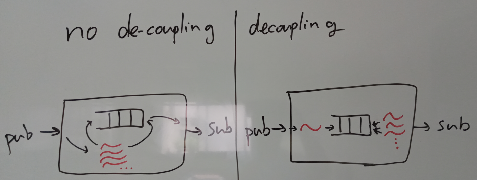

# CSC9006 Real-Time Systems, Lab 3

[TOC]

## 1. Introduction

This lab assignment is an integrated part of the [real-time systems](https://wangc86.github.io/csc9006/) course taught at [National Taiwan Normal University](https://www.ntnu.edu.tw/). You have one month to complete this lab. The hard deadline of submission is Tuesday 10 PM, 6/30/2020. Consider doing this lab as a comprehensive review of the materials covered in this semester. 

In class, we have introduced an example design of a fault-tolerant real-time messaging architecture (based on [the FRAME architecure](https://ieeexplore.ieee.org/abstract/document/8884849)). In particular, we have discussed the impact of publishers' message retention capability. In this lab, we will continue our study by implementing and analyzing a simplified version of this architecture. There are two major learning objectives:

* A fault-tolerant real-time messaging middleware with message retention awareness (built upon Lab2's gRPC pub-sub);
* Empirical performance evaluation of this middleware.


In the rest of this instruction, the text in **boldface** indicates the materials that you should push to your GitHub repository.


## 2. Implementing a fault-tolerant real-time messaging middleware

In the following, we first work on the real-time messaging, and after that we deal with the fault-tolerant part.

### 2.1 Real-time messaging

We consider that the timing requirements for a messaging service come from applications. A real-time messaging service schedules all pending messages in some ways in order to meet the application-specific timing requirements. Here we consider three scheduling strategies: EDF, RM, and FIFO. Before you start to read the next paragraph, **think about how you would implement these scheduling strategies in the context of messaging. Write down your analysis in a text file and name it "analysis1.txt."** You may find that you need to think about how messaging is working in general, and you start to consider that there may be multiple message publishers and multiple message subscribers, and how would that impact the messaging service. If you think that way, that is a good sign. It means that you're starting to get focus on this topic.

Here is an approach to implement these three strategies in a unified way. We use a common data structure called _priority queue_. Using a priority queue, a _pop_ operation will always give us the queued element that is of the top priority. In this sense, implementing EDF, RM, and FIFO is just as deciding the appropriate way to assign a priority level to an element. For EDF, the priority is in the order of the deadline associated with the element; for RM, the priority is in the order of the period associated with the element; for FIFO, the priority is in the order of the time the element is enqueued.

In addition, it give benefits if we can de-couple the task of handling message arrivals from the task of dispatching messages. This can be realized by using one proxy thread and a pool of dispatching threads, as illustrated in the following figure. And you must pin the proxy thread and the set of dispatching threads to two distinct CPU cores. **Write down your analysis of this design decision of de-coupling; list the pros and cons. Name the text file "analysis2.txt."**



In either architecture, multiple threads could concurrently try to read/write the priority queue. Therefore, we should protect the queue by a mutex.

Finally, recall that in order to derive the dispatching deadline from the end-to-end deadline, we need to subtract the end-to-end deadline by the other latencies on the end-to-end path. To be precise, we need to subtract (1) the latency from publisher to broker, (2) the latency from broker to subscriber, AND (3) the interval between the arrival of the message at the broker and the time the message is pushed into the priority queue. You may use the C++'s standard chrono library to do these measurements.

**Now, implement the above architecture using [C++'s standard priority_queue](http://www.cplusplus.com/reference/queue/priority_queue/) and pthreads. Use command-line arguments to**

1. **supply a configuration file to your messaging broker; in the file, at least specify your topic-sending rates and the number of topics for each rate (see Section 3 below for more detail);**
2. **specify which of the three scheduling policies to use according to a command-line argument.**

**To be specific, your implementation should support the following:**

```bash
./yourBroker -c yourConfigFile -s [EDF|RM|FIFO]
```

**Remember to use a mutex to protect your priority queue. AND remember to implement the deadline transformation.** You may build your architecture upon the results of Sections 4.6 and 4.7 in Lab 2.

You should test and see whether your implementation is correct. **Recall what we've discussed about the experimental study in class, and think about how you would perform the test(s). Clearly describe both your plan and how you actually did it. Name the text file "analysis3.txt"** For example, one of the things you should do is to use some task sets that would be scheduled differently if using different scheduling policies.

### 2.2 Fault-tolerant real-time messaging

Let's apply what we've learned in class regarding the fault-tolerant real-time analysis. Here we consider a greatly simplified version:
1. we simply assume the existence of a backup broker and we do not implement it;
2. we assume that all publishers can do the correct switch from the primary broker to the backup broker should the primary broker crash;
3. we assume that the primary broker do not replicate any message to the backup broker and the fault tolerance solely relies on message retransmission from the publisher;
4. we assume that both the backup broker and the message publishers can immediately detect the crash of the primary broker, the backup broker can immediately be promoted to become the new primary broker, and each message publisher can immediately resend all message copies it has retained.

In a word, this is a fake primary-backup system, and we only consider the impact of the publishers' message retention capability to the system. Now, suppose that a publisher will periodically send messages of a certain topic with a period equal to T, and suppose that the publisher can retain copies of N latest messages it has sent. **With all the above information, in order to make sure the messaging service can successfully deliver each message at least once, what would be the timing constraint to the response time of each dispatching task, in addition to the timing constraint derived from the application-specific end-to-end deadline? Write down your analysis and name the text file "analysis4.txt."**

**Now, implement this additional timing constraint for the EDF scheduling policy; that is, for each message, the earliest deadline will be the smallest among this timing constraint and the constraint derived from the application-specific end-to-end deadline.**

## 3. Empirical Evaluation 

We will evaluate the performance of our system from several aspects. First of all, the total load of the system is critical to its real-time performance. In a real-time empirical study, we tend to first find five different levels of system workload so that these five cases would cover a wide range of CPU utilization landscape. In this way, we may see how our system performs as we increase/decrease the workload. 

The load of the system is reflected in the CPU% (which can be measured by top; review Lab 1). We may use some tools to grab CPU% at run-time; for example, on Ubuntu Linux we may use the mpstat utility, which is part of the sysstat package. You can install it via:

```bash
sudo apt install sysstat
```

You may find the example script 'getUtilization.sh' in the repo.

**Now, create five sets of message publishers,  each producing ~20%, ~40%, ~60%, ~80%, and ~100% of CPU utilization on the message broker. Make sure that the message broker is running in a CPU core different from the cores running publishers/subscribers. Create these five sets according to the following steps:**

1. Pick three topic-sending rates (for example: 10 ms, 30 ms, and 50 ms);
2. For each sending rates, determine some appropriate number of topics, so that in total they will cause the message broker to have CPU%=~20%;
3. Now, fixing the sending rates, we increase the workload by _only_ increasing the number of middle-rate topics (e.g., the 30-ms topics). Determine some appropriate numbers so that it will cause ~40%, ~60%, ~80%, and ~100% of CPU utilization in the message broker.
4. **Document both your topic-sending rates and the number of topics for each rate, save them in files named config20.txt, config40.txt, config60.txt, and config80.txt.** You will use these configuration files to let the broker know which configuration it is running (as mentioned in Section 2.1).

In order to create these five sets, you may need to repeatedly experiment on both the rate and the number of each topic. For this purpose, you may also leverage the `run.sh` script, which is mainly designed for the purpose described as follows.

Often, for each test case we need to repeat it several times and obtain (1) the average value, (2) the distribution of the values. We will use bash scripts to help us run the experiments automatically. The example script `run.sh` in the repo does the job. I made up some fake data in the repo to illustrate its usage.

**Now, for each of the EDF, RM, and FIFO scheduling strategies, run the above five sets of workloads, and for each set of workload run each strategy ten times; in each run, allow 30 seconds for the system to warm up, and then measure the CPU% and the latency for two minutes.** Note this means it will take at least 3x5x10x2.5=375 minutes, or around 6 hours, to complete the experiment.

Before we can plot the result, we will also need a pre-processing script to extract the data we need. An example is script `parse_util.sh` in the repo. Finally, we may plot the result using Matplotlib (we have used it in Lab 1). **Plot the following three figures:**

1. The _CPU utilization_ for each of the five sets of message publishers. One for each of the EDF, RM, and FIFO scheduling strategies;
2. The _average end-to-end latency_ for each of the five sets of message publishers. One for each of the EDF, RM, and FIFO scheduling strategies;
3. The _99-th percentile of the end-to-end latency_ for each of the five sets of message publishers. Again, one for each of the EDF, RM, and FIFO scheduling strategies.

**And finally, give an analysis of these empirical results. Describe your setup, and compare the performance of EDF, RM, and FIFO, in a way like those research papers you have read did. Name the file "analysis5.txt"**


## 4. Summary

It is nontrivial to do experimental computer science study. I hope this Lab may offer you some concrete experiences of this art. In summary, a serious experimental study requires
- Careful planning of the experiments:
- Familiarity of both scripting and the usage of related tools: 
- Patience: experiments often take nontrivial amount of time to complete. A good planning and some handy scripts can save you a lot of time.

That is all this course can offer. Take this experience with you. Bon voyage!
